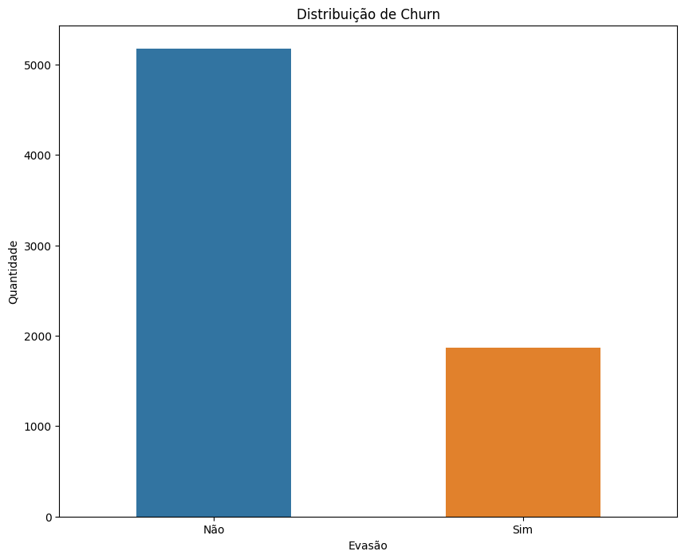
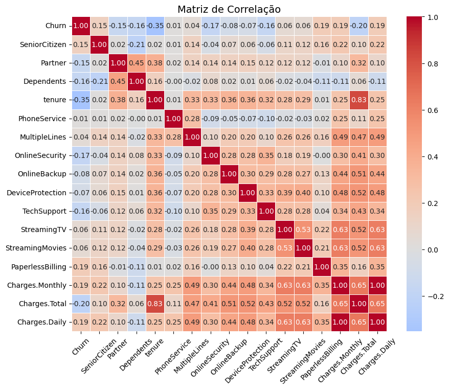

Relatório de evasão de clientes

Autor: Matheus Pereira Costa

Data: 14/06/2025

Contextualização

De acordo com os ultimos dados obtidos foram percebidos um aumento no número de evasões de clientes devido a esse mótivo foi solicitado um estudo sobre as possíveis causas e se haveriam alguma relação entre elas.

Metodologia

A metodologia aplicada para obter os dados foi através da biblioteca requests onde foi feito uma consulta do tipo get na API que se encontra em GitHub.

Após trazer esses dados para dentro do projeto de análise, foi verificado que ele havia 7267 linhas e 6 colunas. Foi transformado em dataframe com a biblioteca do pandas e posteriormente expandidas as colunas que estavam com dados em formato de dicionário usando pd.json_normalize, resultando em um dataframe com 7267 linhas e 22 colunas.

Validação dos Dados

- Não foram encontrados dados nulos ou duplicados
- Padronização de colunas binárias (Yes/No transformado para formato binominal numérico 1/0)
- Padronização de dados com mais de uma forma de escrita, exemplo (No/No phone service)
- Identificados e removidos 224 casos com espaços em branco na coluna Churn

Análise Exploratória

Taxa de evasão (Churn): 26.54% do total

Tabelas de apoio

Ressalta-se que como os dados binários foram transformados para númericos então em colunas com 0 significa não/não evadiu e 1 sim/evadiu

Categóricas

Gender

|   Churn | gender   |   Count |
|---------|----------|---------|
|       0 | Female   |    2549 |
|       0 | Male     |    2625 |
|       1 | Female   |     939 |
|       1 | Male     |     930 |

SeniorCitizen

|   Churn |   SeniorCitizen |   Count |
|---------|-----------------|---------|
|       0 |               0 |    4508 |
|       0 |               1 |     666 |
|       1 |               0 |    1393 |
|       1 |               1 |     476 |

Contract

|   Churn | Contract       |   Count |
|---------|----------------|---------|
|       0 | Month-to-month |    2220 |
|       0 | One year       |    1307 |
|       0 | Two year       |    1647 |
|       1 | Month-to-month |    1655 |
|       1 | One year       |     166 |
|       1 | Two year       |      48 |

PaymentMethod

|   Churn | PaymentMethod             |   Count |
|---------|---------------------------|---------|
|       0 | Bank transfer (automatic) |    1286 |
|       0 | Credit card (automatic)   |    1290 |
|       0 | Electronic check          |    1294 |
|       0 | Mailed check              |    1304 |
|       1 | Bank transfer (automatic) |     258 |
|       1 | Credit card (automatic)   |     232 |
|       1 | Electronic check          |    1071 |
|       1 | Mailed check              |     308 |

Numéricas

|   Churn |   Charges.Daily.Sum |   Charges.Daily.Mean |   Charges.Daily.Std |   Charges.Monthly.Sum |   Charges.Monthly.Mean |   Charges.Monthly.Std |   Charges.Total.Sum |   Charges.Total.Mean |   Charges.Total.Std |   Tenure.Sum |   Tenure.Mean |   Tenure.Std |
|-----------------|----------------------------|-----------------------------|----------------------------|------------------------------|-------------------------------|------------------------------|----------------------------|-----------------------------|----------------------------|---------------------|----------------------|---------------------|
|               0 |                   10566.2  |                     2.04217 |                   1.03642  |                       316986 |                       61.2651 |                      31.0926 |                1.31932e+07 |                     2555.34 |                    2329.46 |              194387 |              37.57   |             24.1138 |
|               1 |                    4637.69 |                     2.48138 |                   0.822202 |                       139131 |                       74.4413 |                      24.6661 |                2.86293e+06 |                     1531.8  |                    1890.82 |               33603 |              17.9791 |             19.5311 |

Gráficos

Conclusão
Ao avaliar os dados, é possível compreender que entre os clientes que deixaram a empresa estão aqueles que possuem o contrato de Month-to-Month representam 88.55% do total que deixaram a empresa.

Outra categoria que trâs dados importantes sobre o caso é o metodo de pagamento ou PaymentMethod, que os que optaram pela modalidade Electronic check representam 57.30% do total que deixaram a empresa.

A correlação é fraca entre os elementos ao compara-los com a coluna de evasão/Churn.

Portanto, para solucionar o problema sugiro uma revisão nos contratos e na forma de pagemnto sendo eles como causadores principais de tais efeitos.
